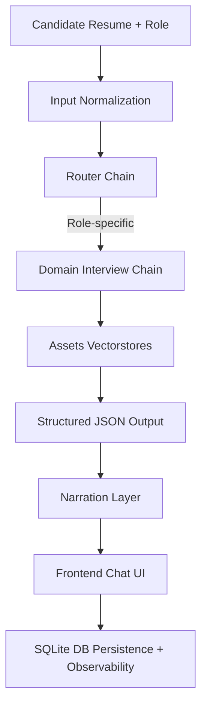

# HireQuest — Agentic Interview Simulation System

HireQuest is a modular LangChain‑based agentic interview system designed to simulate structured technical interviews. It dynamically generates questions based on a candidate’s resume, the selected job role, and a role‑specific knowledge base.

The system integrates a React frontend, FastAPI backend, SQLite database, and Assets service for preprocessing/vectorstores, making it deployment‑ready and recruiter‑friendly.

## ✨ Features

  - Role‑based orchestration — dynamic interview chains per job role

  - Resume‑aware question generation — contextual prompts from candidate input

  - Configurable interview length — step‑by‑step Q&A flow

  - FastAPI backend — RESTful endpoints for orchestration

  - React frontend — recruiter‑friendly chat interface

  - SQLite database — lightweight persistence for sessions and results

  - Database observability — audit logs and tracking endpoints for transparency

  - Data persistence — conversations stored in DB for replay and analytics

  - Context‑aware agent — conversation history passed into chains for coherent multi‑turn interviews

---

## 🏛 Architecture Overview


---

## 📂 Project Structure

```bash
HireQuest/
│
├── assets/                  # Preprocessing + vectorstore build service
│   └── src/assets/
│       ├── build/           # Index build pipelines
│       ├── chunks/          # Resume/interview chunks
│       ├── cleaned_data/    # Normalized datasets
│       ├── raw_data/        # Raw resumes/datasets
│       └── vectorstores/    # FAISS indexes
│
├── backend/                 # FastAPI backend service
│   └── src/backend/
│       ├── api/             # candidate.py, interview.py
│       ├── db/              # models, crud, db.py, db_tracking.py
│       ├── services/        # domain_chains, router_chain, summary_chain
│       ├── middleware/      # parser, helpers
│       └── schemas/         # Pydantic schemas
│
├── db/                      # migrations + init.sql
│   └── interview.db         # SQLite file
│
├── frontend/                # React + Tailwind UI
│   └── src/components/      # ChatUI, LandingPage
│
├── notebooks/               # Jupyter experiments
│   
├── requirements.txt
├── pyproject.toml
└── README.md
```
---

## 🔄 Interview Pipeline

### Offline Build Pipeline

Role Knowledge Base
    ↓
Cleaned Datasets
    ↓
Chunking + Embeddings
    ↓
FAISS Vectorstores

### Online Interview Pipeline

Candidate Resume + Role
    ↓
Router Chain
    ↓
Role-specific Interview Chain
    ↓
Structured JSON Output
    ↓
Narration Layer
    ↓
Frontend Chat UI
    ↓
SQLite DB Tracking + Observability

---

## 🔍 Database Observability & Persistence

HireQuest includes built‑in database observability to make interview session data transparent and auditable:

 - InterviewHistory — stores Q&A transcript with timestamps

 - InterviewConfig — tracks session configuration (role, number of questions)

 - InterviewSummary — recruiter‑friendly evaluation (strengths, improvements, overall)

 - Tracking endpoints — /db/tables, /db/table/{name} for recruiter/demo clarity

 - Conversation replay — stored Q&A can be reviewed for analytics or recruiter dashboards

 - Endpoints: 

      - /db/tables
      - /db/table/candidates
      - /db/table/interview_history

---

## 📜 Schemas & API Contract

HireQuest uses Pydantic schemas to define the API contract:

 - StartInterviewRequest — candidate_id, role, n_questions

 - AnswerRequest — candidate_id, role, question, answer

 - InterviewRequest — candidate_id, role

 - InterviewResponse — question, role, domain, context

 - This ensures structured, validated communication between frontend and backend.

---

## ⚙️ Tech Stack

 - LangChain Core (LCEL)

 - FastAPI

 - React + TailwindCSS

 - SQLite

 - FAISS

 - HuggingFace Embeddings

 - OpenAI GPT‑4o‑mini

---

## 🚀 Installation

### Backend Setup

1. Clone Repository

```bash
git clone https://github.com/pranavmadhahar/hirequest.git
cd hirequest
```

2. Create Virtual Environment

```bash
python -m venv myenv
source myenv/bin/activate
```

3. Install Dependencies

```bash
cd backend
pip install -r requirements-dev.txt
```

4. Configure Environment Variables

Create a .env file from .env.example and add:

```Env
OPENAI_API_KEY=your_openai_api_key
```
---

### ▶️ Running the Backend

From project root:

```bash
uvicorn backend.src.backend.main:app --reload
```

Backend runs at:

```code
http://127.0.0.1:8000
```
Swagger docs:

```code
http://127.0.0.1:8000/docs
```

### Frontend Setup

 1. Navigate to frontend folder:

```bash
cd frontend
```
 2. Install dependencies
```bash
npm install
```
 3. Run development server
```bash
npm run dev
```

Frontend runs at:
```Code
http://localhost:5173
```
---

## 📈 Future Improvements

 - Semantic routing with embeddings

 - Streaming interview responses

 - Recruiter dashboard frontend

 - LangGraph orchestration

 - Hybrid retrieval + reranking

 - PostgreSQL/Redis memory backend

 - Confidence scoring in summaries

 - Analytics‑ready metadata (difficulty, tags)

---

## 📝 Summary

HireQuest combines:

 - Resume‑aware orchestration

 - Role‑specific knowledge bases

 - Structured JSON pipelines

 - Recruiter‑friendly frontend

 - Database observability & persistence

 - Context‑aware agent with multi‑turn memory

into a scalable, demo‑ready AI project for technical interviews.


