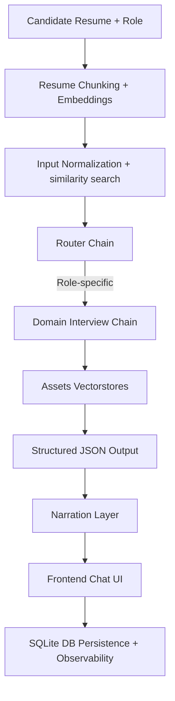

# HireQuest — Agentic Interview Simulation System

HireQuest is a modular LangChain‑based agentic interview system designed to simulate structured technical interviews. It dynamically generates questions based on a candidate’s resume, the selected job role, and a role‑specific knowledge base.

The system integrates a React frontend, FastAPI backend, SQLite database, and Assets service for preprocessing/vectorstores, making it deployment‑ready and recruiter‑friendly.

## ✨ Features

  - Role‑based orchestration — dynamic interview chains per job role

  - Resume‑aware question generation — contextual prompts from candidate input

  - Configurable interview length — step‑by‑step Q&A flow

  - FastAPI backend — RESTful endpoints for orchestration

  - React frontend — recruiter‑friendly chat interface

  - SQLite database — lightweight persistence for sessions and results

  - Database observability — audit logs and tracking endpoints for transparency

  - Data persistence — conversations stored in DB for replay and analytics

  - Context‑aware agent — conversation history passed into chains for coherent multi‑turn interviews

---

## 🏛 Architecture Overview


---

## 📂 Project Structure

```bash
HireQuest/
│
├── assets/                  # Preprocessing + vectorstore build service
│   ├── Dockerfile
│   ├── entrypoint.sh
│   ├── pyproject.toml
│   ├── requirements.txt
│   └── src/assets/
│       ├── build/           # Index build pipelines
│       ├── chunks/          # Resume/interview chunks
│       ├── cleaned_data/    # Normalized datasets
│       ├── raw_data/        # Raw resumes/datasets
│       ├── vectorstores/    # FAISS indexes
│       ├── __init__.py
│       └── __pycache__/
│
├── backend/                 # FastAPI backend service
│   ├── Dockerfile
│   ├── pyproject.toml
│   ├── requirements.txt
│   ├── requirements-dev.txt
│   └── src/backend/
│       ├── api/             # candidate.py, interview.py
│       ├── db/              # models, crud, db.py, db_tracking.py
│       ├── services/        # domain_chains, router_chain, summary_chain
│       ├── middleware/      # parser, helpers
│       ├── schemas/         # Pydantic schemas
│       ├── main.py
│       └── config.py
│
├── frontend/                # React + Tailwind UI
│   └── src/components/      # ChatUI, LandingPage
│
├── data/                    # Host-mounted data folders (gitignored)
│   ├── db/                  # SQLite database
│   ├── raw_data/            # Raw PDFs, resumes, corpora
│   ├── cleaned_data/        # Normalized JSONs
│   ├── chunks/              # Chunked JSONs
│   └── vectorstores/        # FAISS indexes
│
├── db/                      # Migrations + init.sql
│   └── interview.db         # SQLite file
│
├── notebooks/               # Jupyter experiments
│
├── docker-compose.yaml
├── k8s/                     # Kubernetes manifests
├── myenv/                   # Local Python virtual environment
├── README.md
└── interview.db             # SQLite file (local dev)
```
---

## 🔄 Interview Pipeline

### Offline Build Pipeline
- Role Knowledge Base  
  ↓  
- Cleaned Datasets  
  ↓  
- Chunking + Embeddings  
  ↓  
- FAISS Vectorstores  

### Online Interview Pipeline
- Candidate Resume + Role  
  ↓  
- Router Chain  
  ↓  
- Role-specific Interview Chain  
  ↓  
- Structured JSON Output  
  ↓  
- Narration Layer  
  ↓  
- Frontend Chat UI  
  ↓  
- SQLite DB Tracking + Observability  

---

## 🔍 Database Observability & Persistence

HireQuest includes built‑in database observability to make interview session data transparent and auditable:

 - InterviewHistory — stores Q&A transcript with timestamps

 - InterviewConfig — tracks session configuration (role, number of questions)

 - InterviewSummary — recruiter‑friendly evaluation (strengths, improvements, overall)

 - Tracking endpoints — /db/tables, /db/table/{name} for recruiter/demo clarity

 - Conversation replay — stored Q&A can be reviewed for analytics or recruiter dashboards

**Endpoints:**

  - "/db/tables"

```json
{
  "tables": ["candidates", "interview_history", "interview_config", "interview_summary"]
}
```
  - "/db/table/interview_history"

```json
[
  {
    "id": 42,
    "candidate_id": 7,
    "role": "backend_engineer",
    "question": "Explain ACID properties in databases",
    "answer": "Atomicity ensures..."
  }
]
```

---

## 📜 Schemas & API Contract

HireQuest uses Pydantic schemas to define the API contract:

 - StartInterviewRequest — candidate_id, role, n_questions

 - AnswerRequest — candidate_id, role, question, answer

 - InterviewRequest — candidate_id, role

 - InterviewResponse — question, role, domain, context

 - This ensures structured, validated communication between frontend and backend.

---

## ⚙️ Tech Stack

 - LangChain Core (LCEL)

 - FastAPI

 - React + TailwindCSS

 - SQLite

 - FAISS

 - HuggingFace Embeddings

 - OpenAI GPT‑4o‑mini

---

## 📂 Data Folders & Gitignore

⚠️ These folders are .gitignored and won’t exist after clone. Create them manually:

For docker based deployment:

```bash
mkdir -p data/db data/raw_data data/cleaned_data data/chunks data/vectorstores
```

For local setup:

```bash
mkdir -p assets/raw_data assets/cleaned_data assets/chunks assets/vectorstores
```

---

## 🧭 Workflow Summary

 - Place raw PDFs into ./data/raw_data for docker compose based deployment.

 - Run docker-compose up.

 - For local setup place raw PDF's into /assets/raw_data dir

 - Assets preprocess → cleaned JSONs → chunks → FAISS indexes.

 - Backend loads indexes by role (Data_Science, ML, etc.).

 - Frontend serves recruiter/demo UI.

---

## 🚀 Installation

### 🔑 Environment Variables

```bash
cp .env.example .env
```

Fill in:

```env
OPENAI_API_KEY=your-openai-api-key-here
VECTORSTORES_DIR=/home/username/dirname/HireQuest/assets/src/assets/vectorstores
DATABASE_URL=sqlite:////home/username/dirname/HireQuest/interview.db
```

Note: Mention absolute paths in VECTORSTORES_DIR and DATABASE_URL. Example paths mentioned above.

### Run Stack With One Command

```bash
docker-compose up --build
```

 - Frontend → http://localhost:3000

 - Backend → http://localhost:8000/api/...

 - Assets → preprocesses raw data and builds FAISS indexes

### Backend Setup

1. Clone Repository

```bash
git clone https://github.com/pranavmadhahar/hirequest.git
cd hirequest
```

2. Create Virtual Environment

```bash
python -m venv myenv
source myenv/bin/activate
```

3. Install Dependencies

```bash
cd backend
pip install -r requirements-dev.txt
```

---

### ▶️ Running the Backend

From project root:

```bash
uvicorn backend.src.backend.main:app --reload
```

Backend runs at:

```code
http://127.0.0.1:8000
```
Swagger docs:

```code
http://127.0.0.1:8000/docs
```

### Frontend Setup

 1. Navigate to frontend folder:

```bash
cd frontend
```
 2. Install dependencies
```bash
npm install
```
 3. Run development server
```bash
npm run dev
```

Frontend runs at:
```code
http://localhost:5173
```
---

## 📈 Future Improvements

 - Streaming interview responses

 - Recruiter dashboard frontend

 - LangGraph orchestration

 - Hybrid retrieval + reranking

 - PostgreSQL/Redis memory backend

 - Confidence scoring in summaries

 - Analytics‑ready metadata (difficulty, tags)

---

## 📚 Reference Data Sources

Machine Learning

 - Machine Learning — Tom Mitchell

 - The Hundred-Page Machine Learning Book — Andriy Burkov

 - Machine Learning for Absolute Beginners

Data Science

 - Introduction to Machine Learning with Python

 - Master Machine Learning Algorithms — Jason Brownlee

Advanced ML

 - Pattern Recognition and Machine Learning — Christopher Bishop

 - Artificial Intelligence, Machine Learning & Deep Learning

---

## 📝 Summary

HireQuest combines:

 - Resume‑aware orchestration

 - Role‑specific knowledge bases

 - Structured JSON pipelines

 - Recruiter‑friendly frontend

 - Database observability & persistence

 - Context‑aware agent with multi‑turn memory

into a scalable, demo‑ready AI project for technical interviews.


